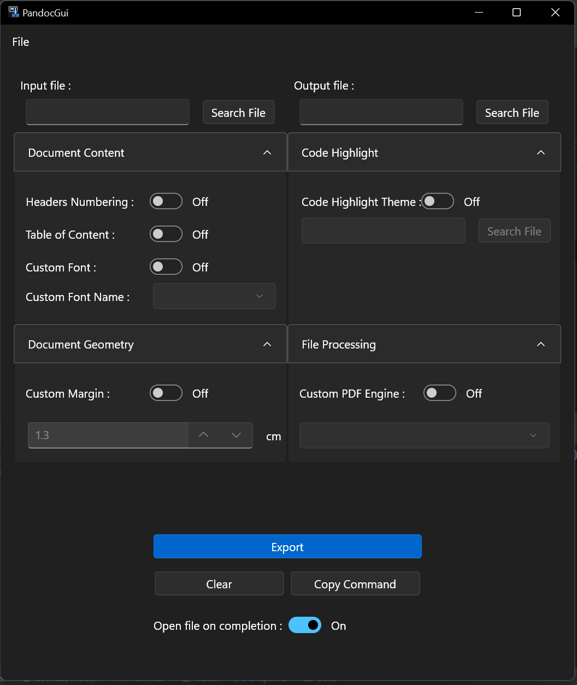

# Pandoc GUI


This software aims to provide a clean and modern GUI to generate PDF documents from markdown using Pandoc, with the ability to pass several options, like : 

- Custom code highlithing theme
- Headings numbers
- Font
- Link color
- Margin
- PDF Engine
- Table of contents

Pandoc GUI runs on .NET 6.

## Screenshots



## Prerequisites

### Windows

Check that you have Pandoc and MikTex installed.

#### Using Chocolatey

```bash
choco install pandoc miktex -y
```

#### Using winget

```bash
winget install MiKTex
winget install Pandoc
```

### Linux

```bash
sudo apt-get install pandoc texlive-latex-extra texlive-latex-recommended
```

### MacOs

```bash
brew install pandoc
curl http://mirror.ctan.org/systems/mac/mactex/BasicTeX.pkg -o
sudo installer -pkg BasicTeX.pkg -target /
```

## Install Release

### Windows

 - [Download Installer from release](https://github.com/Ombrelin/pandoc-gui/releases/latest)
 - Just run the installer

No need to install the .NET 6 Runtime, it has been bundled in the executable.

### MacOS

WIP

### Linux (Debian based)

- [Download the deb package from release](https://github.com/Ombrelin/pandoc-gui/releases/latest)
- `sudo dpkg -i <deb package>` to install the deb package
- `PandocGui` to launch the app

No need to install the .NET 6 Runtime, it has been bundled in the executable.

## Run Dev

Make sure you have the latest .NET 6 SDK installed.

```bash
git clone https://github.com/Ombrelin/pandoc-gui
cd pandoc-gui/src/PandocGui
dotnet run
```

> On Mac / Linux : `sudo dotnet run`

## Special Thanks

- AvaloniaUI
- ReactiveUI
- Pandoc
- [@Naaviiss](https://github.com/Naaviiss) for help with macOS run & deployment
- [@Grandkhan](https://github.com/Grandkhan) for the app icon
